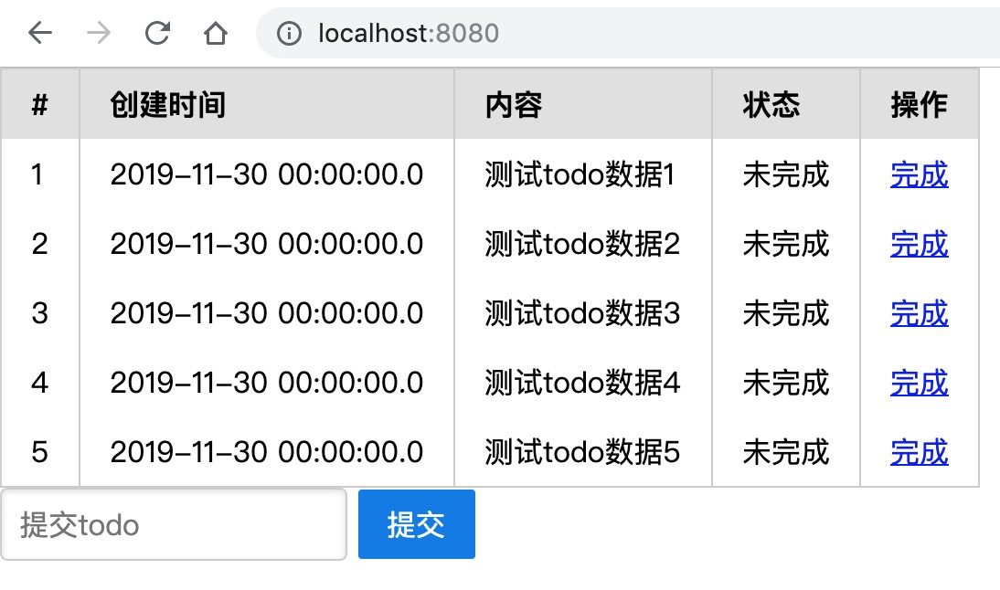

## todo list

SpringMVC学习 正在增加功能中

数据库
    
    http://localhost:8080/database
    jdbc url: jdbc:h2:mem:todo
    user: root
    pwd: root

页面
[http://localhost:8080/](http://localhost:8080/ )    

